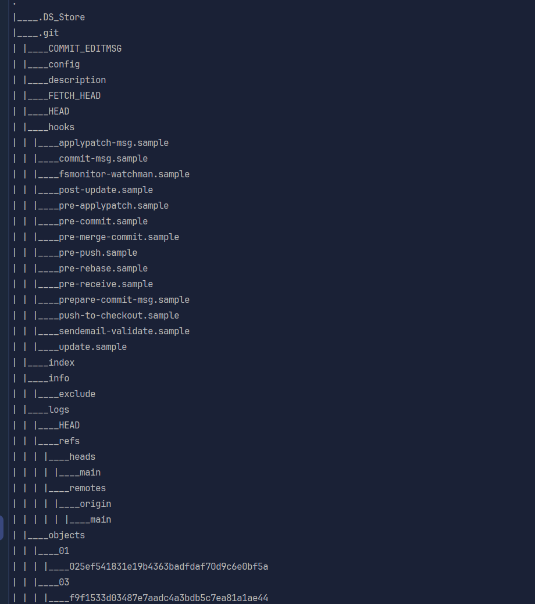

# 🛒 Capstone Client Web Application

A single-page front-end for the EasyShop capstone project. Browse products, filter them, log in, shop—and now enjoy light/dark themes and a branded background.

---

## 🔍 Features

- **Light/Dark Mode** toggle (☀️ / 🌙)  
- **3-color gradient** background (or replaceable images)  
- Product grid with filters (category, price, color…)  
- Login modal (uses backend JWT API)  
- Shopping cart interactions (add, view, clear)

---

## 🚀 Install & Run
1. **Clone**  
   ```bash
   git clone https://github.com/Bilenie/capstone-client-web-application.git
   cd capstone-client-web-application
Serve files

Open index.html directly in browser
Or run a static server:

bash
npx http-server .
Browse at the URL shown (e.g. http://localhost:8080)

## ⚙️ Usage

Click ☀️/🌙 at top-right to switch themes (saved in browser).

Browse & filter products in the grid.

“Add to Cart” on any product, then click cart icon in header.

“Login” opens the auth modal—enter credentials to receive JWT for secure actions.

## 🎨 Added featrue => Styling Customization

In css/main.css (bottom):

css

body {
  background: linear-gradient(120deg, #fdfcfb, #e2d1c3, #a18cd1);
}
body.dark-mode {
  background: linear-gradient(to right, #232526, #414345, #000000);
}
To use images instead of gradients:

css

body {
  background: url('images/light-bg.jpg') no-repeat center/cover;
}
body.dark-mode {
  background: url('images/dark-bg.jpg') no-repeat center/cover;
}

## 📂 Structure

css/
  main.css
js/
  application.js   ← app logic
  theme.js         ← theme toggle
  filter.js
  services/*.js    ← API calls
index.html

## 🤝 Credits
Eric Shwartze – instructor 
YearUp – tutor and peers
OpenAI’s ChatGPT – AI assistance for planning and README drafting
Bootstrap, Axios, Mustache, and other open-source libraries
